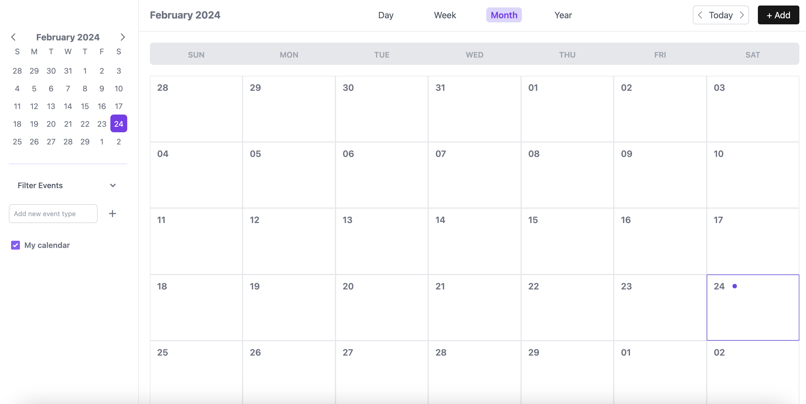

# Cronus Appointment


[](https://github.com/phuonganhniie/chronus-appoinment/blob/main/LICENSE)

Welcome to Cronus Appointment, a web application designed to simplify your scheduling and event management needs. Our application offers a comprehensive set of features aimed at enhancing your organizational efficiency and streamlining your event handling process.

## ✨ Key Features
### User Authentication
Securely manage access to your calendar and events with robust user authentication mechanisms.

### Calendar Management
Efficiently organize your schedules with our intuitive calendar interface, making it easy to plan and manage your time.

### Events Management
Create, edit, and manage your events with ease. Our events management module is designed to cater to your diverse scheduling needs.

### Filter Events
Quickly find the events you're looking for with our powerful filtering options, allowing you to sort and view events by various criteria.

## ⚡️ Technology Stack
- **Backend:** ExpressJS
- **Frontend:** ReactJS integrated with Tailwind CSS for responsive and modern UI designs.
- **Database:** Postgres for robust and reliable data storage.
- **Authentication:** JSON Web Tokens (JWT) for secure and scalable user authentication.
- **ORM:** Prisma ORM for efficient database management and operations.

## 🔨 Requirements
- Node, recommended `20.x`, minimum `18`
- Postgres, recommended `14.0`, minimum `13`
- [Visual Studio Code](https://code.visualstudio.com/) with [recommended extensions](.vscode/extensions.json)

## 👋 Getting Started
To get started with Cronus Appointment, follow these simple steps:

1. Clone the repository:
   ```bash
   git clone https://github.com/phuonganhniie/chronus-appointment.git
   ```
   
2. Install dependencies
   ```bash
   # For backend
    cd chronus-appointment/server
    npm install or yarn add

   # For frontend
    cd chronus-appointment/client
    npm install or yarn start
    ```
    
3. Set up your environment variables
By creating a `.env` file in the root of both the backend and frontend directories. Refer to the `.env.example` file for required variables.

4. Start the development servers:
    ```bash
    # For backend
    npm run start
    
    # For frontend
    npm run start
    ```

5. Open `http://localhost:3000` in your browser to view the application.

## 🔎 Future Features
- <b>Collaboration</b>: Enable collaboration with multiple users, fostering teamwork and shared event management.
- <b>User Management</b>: Streamline user registration, profile updates, and password management.
- <b>Recurring Events</b>: Support for recurring events to simplify scheduling repetitive tasks and appointments.
- <b>Reminders & Notifications</b>: Timely reminders and notifications to keep users informed about upcoming events and important updates.

## 📖 License
Cronus Appointment is released under MIT License. See the LICENSE file for more details.

## ❤️ Contact
For any queries or further information, please reach out to me at [phuonganhniie@gmail.com].
